# Chunk 117 Double Prefix Analysis Report

## 🎯 Executive Summary

**Issue**: The RAG system generates chunks with malformed IDs like `chunk_chunk_117_1` and `chunk_chunk_117_2` instead of the expected `chunk_117_1` and `chunk_117_2`.

**Root Cause**: Double prefixing in the chunking pipeline when long chunks are split into smaller parts.

**Impact**: 
- Confusing chunk naming convention
- Potential retrieval performance issues  
- Inconsistent ID patterns across the vector database

**Status**: ✅ **IDENTIFIED AND SOLUTION TESTED**

---

## 🔍 Technical Analysis

### Current Problematic Flow

```mermaid
graph TD
    A[WangChai KB Content<br/>1725 chars, 432 tokens] --> B[createChunk 117]
    B --> C[chunk_117<br/>Main chunk created]
    C --> D{Tokens > 300?}
    D -->|YES| E[splitLongChunk called]
    E --> F[createChunk chunk_117_1]
    F --> G[chunk_chunk_117_1<br/>❌ DOUBLE PREFIX]
    E --> H[createChunk chunk_117_2] 
    H --> I[chunk_chunk_117_2<br/>❌ DOUBLE PREFIX]
```



### Code Analysis

#### 1. Initial Chunk Creation
```javascript
// Line 260 in build-embeddings-nodejs.js
createChunk(id, text, metadata) {
  return {
    id: `chunk_${id}`,  // ✅ Correct: Creates "chunk_117"
    // ...
  };
}
```

#### 2. Long Chunk Splitting (THE BUG)
```javascript
// Lines 296-297 in build-embeddings-nodejs.js
subChunks.push(this.createChunk(
  `${chunk.id}_${subChunkIndex}`,  // ❌ BUG: chunk.id is already "chunk_117"
  chunkText.trim(),
  // ...
));
```

**Problem**: 
- `chunk.id` = `"chunk_117"`
- Template becomes: `"chunk_117_1"`
- `createChunk()` adds prefix: `"chunk_" + "chunk_117_1"` = `"chunk_chunk_117_1"`

---

## 📊 Current Vector Database State

Found 2 affected chunks in `/Users/sonyschan/NYLAgo/pwa/data/nyla-vector-db.json`:

### chunk_chunk_117_1
- **Parent**: `chunk_117`
- **Content**: WangChai project overview (1145 chars, 287 tokens)
- **Section**: `ecosystem_wangchai_project_overview`
- **Chunk Part**: 1

### chunk_chunk_117_2  
- **Parent**: `chunk_117`
- **Content**: NYLA-WangChai AMA information (583 chars, 146 tokens)
- **Section**: `ecosystem_wangchai_project_overview`  
- **Chunk Part**: 2

---

## 🧪 Testing & Validation

### Test Results Summary
```
🔴 BROKEN BEHAVIOR:
   Input: chunk_117 (432 tokens) → Split needed
   Output: 
   ❌ chunk_chunk_117_1 (287 tokens)
   ❌ chunk_chunk_117_2 (146 tokens)

🟢 FIXED BEHAVIOR:
   Input: chunk_117 (432 tokens) → Split needed  
   Output:
   ✅ chunk_117_1 (287 tokens)
   ✅ chunk_117_2 (146 tokens)
```

### Edge Case Validation
- ✅ Already prefixed IDs handled correctly
- ✅ Numeric IDs work properly
- ✅ String IDs without prefix work properly
- ✅ Parent-child relationships preserved

---

## 💡 Recommended Solution

### Fixed Code Implementation

#### 1. Enhanced createChunk Function
```javascript
createChunk(id, text, metadata) {
  // Prevent double prefixing
  const idStr = String(id);
  const finalId = idStr.startsWith('chunk_') ? idStr : `chunk_${idStr}`;
  
  return {
    id: finalId,
    text: text.trim(),
    tokens: this.estimateTokens(text),
    metadata: {
      created_at: new Date().toISOString(),
      ...metadata
    }
  };
}
```

#### 2. Fixed splitLongChunk Function
```javascript
splitLongChunk(chunk, maxTokens = 300) {
  if (chunk.tokens <= maxTokens) {
    return [chunk];
  }
  
  // Extract base ID without chunk_ prefix for clean sub-chunk naming
  const baseId = chunk.id.replace(/^chunk_/, '');
  
  // ... splitting logic ...
  
  subChunks.push(this.createChunk(
    `${baseId}_${subChunkIndex}`,  // ✅ Use base ID, createChunk will add prefix
    chunkText.trim(),
    {
      ...chunk.metadata,
      parent_chunk: chunk.id,
      chunk_part: subChunkIndex,
      has_overlap: subChunkIndex > 1
    }
  ));
}
```

---

## 🎯 Key Scenarios Analysis

### Chunking Scenarios Overview

| Scenario | Original Size | Action | Result |
|----------|---------------|--------|---------|
| **Short content** | <300 tokens | No split | `chunk_N` |
| **Medium content** | 300-600 tokens | Split into 2 | `chunk_N_1`, `chunk_N_2` |
| **Long content** | >600 tokens | Split into 3+ | `chunk_N_1`, `chunk_N_2`, `chunk_N_3`, ... |

### WangChai Specific Case
- **Source**: `/pwa/kb/ecosystem/partners/multi-chain/wangchai.json`
- **KB Chunk ID**: `ecosystem_wangchai_project_overview`
- **Content**: 1725 characters → 432 estimated tokens
- **Split Threshold**: 300 tokens
- **Result**: Split into 2 parts (287 + 146 tokens)

---

## 🚀 Implementation Plan

### Phase 1: Code Fix
1. ✅ **COMPLETED**: Identify root cause in `build-embeddings-nodejs.js`
2. ✅ **COMPLETED**: Develop and test fix
3. 🔄 **NEXT**: Apply fix to production code

### Phase 2: Data Cleanup  
1. Rebuild embeddings with fixed chunking logic
2. Verify correct chunk naming in vector database
3. Update any references to old chunk IDs

### Phase 3: Validation
1. Run full embedding build process
2. Verify no `chunk_chunk_` patterns exist
3. Confirm RAG retrieval works correctly

---

## 📋 File Locations

### Source Files
- **Main chunking logic**: `/pwa/js/rag/build-embeddings-nodejs.js` (lines 258-354)
- **Vector database**: `/pwa/data/nyla-vector-db.json`
- **Knowledge base**: `/pwa/kb/ecosystem/partners/multi-chain/wangchai.json`

### Test Files  
- **Analysis script**: `/tests/rag/chunk-117-analysis.js`
- **Fix validation**: `/tests/rag/chunk-117-fix-test.js`

---

## 🎉 Expected Outcomes

### After Fix Implementation
1. **Clean Naming**: All chunk IDs follow `chunk_N` or `chunk_N_M` pattern
2. **Consistency**: No more `chunk_chunk_` double prefixes  
3. **Maintainability**: Clear, predictable chunk ID structure
4. **Performance**: Improved retrieval with consistent naming
5. **Debugging**: Easier to trace chunk relationships

### No Breaking Changes
- Parent-child relationships preserved
- Metadata structure unchanged
- Chunk content and embeddings unchanged
- Only chunk IDs are corrected

---

## 🔍 Monitoring & Prevention

### Future Safeguards
1. Add unit tests for chunking logic
2. Implement ID validation in createChunk function
3. Add warnings for suspicious chunk ID patterns
4. Regular audits of vector database structure

### Quality Checks
```javascript
// Example validation
function validateChunkId(id) {
  const pattern = /^chunk_\d+(_\d+)?$/;
  if (!pattern.test(id)) {
    console.warn(`Invalid chunk ID pattern: ${id}`);
  }
}
```

---

**Report Generated**: 2025-08-18  
**Analysis Status**: ✅ Complete  
**Fix Status**: ✅ Tested & Ready for Implementation