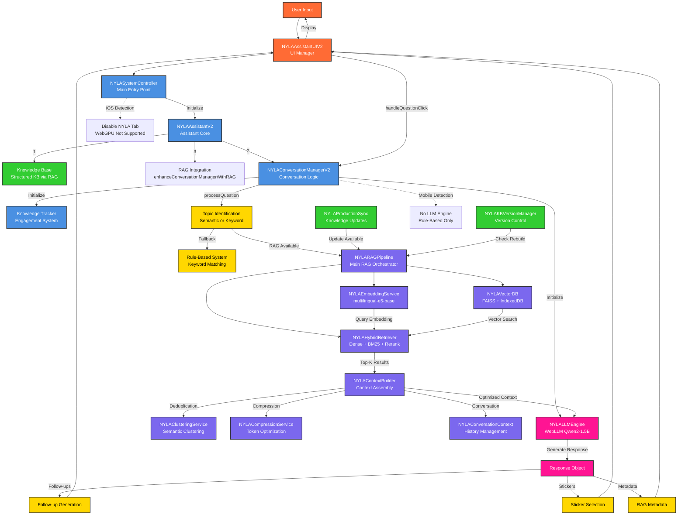
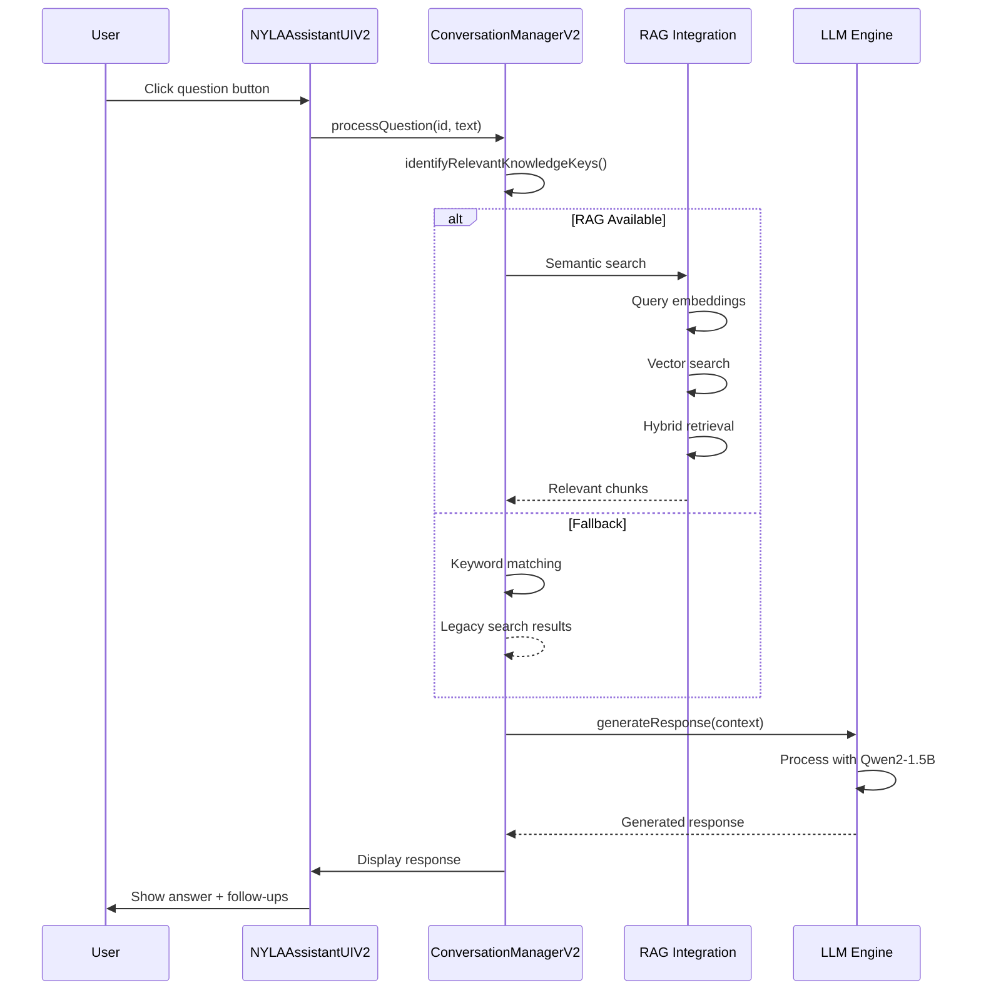
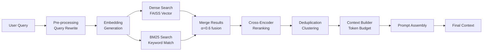
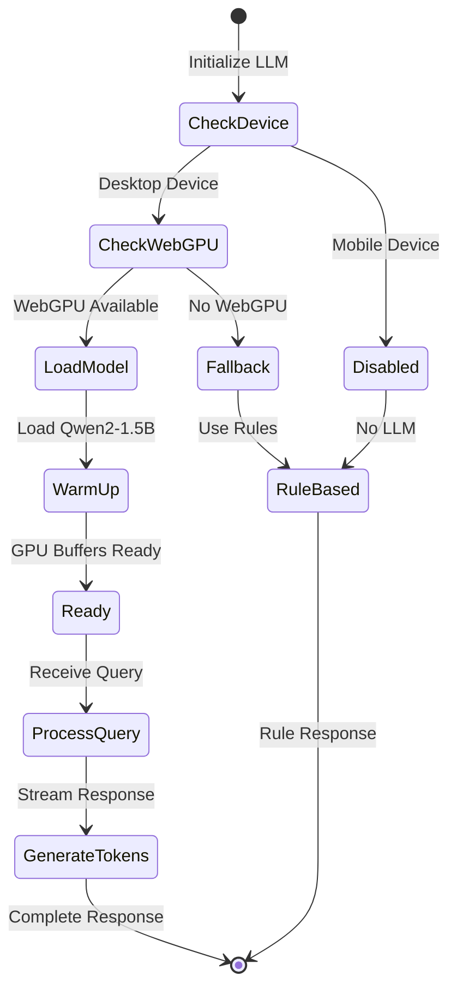

# NYLA AI System Architecture Flow Diagram

## Overview
The NYLA AI system is a sophisticated RAG-powered assistant that combines local LLM inference (WebLLM), vector search (FAISS), and hybrid retrieval to provide intelligent responses about cryptocurrency transfers and blockchain technology.

## Complete System Flow



## Detailed Component Interactions

### 1. **User Query Processing Flow**



### 2. **RAG Pipeline Details**



### 3. **LLM Processing Flow**



## Key Data Transformations

### 1. **Query → Embeddings**
- Input: "How do I send tokens on Solana?"
- Tokenization: ~8 tokens
- Embedding: 768-dimensional vector (multilingual-e5-base)

### 2. **Embeddings → Retrieved Chunks**
- Vector Search: Top-20 similar chunks
- BM25 Search: Top-20 keyword matches
- Fusion: Weighted combination (α=0.6)
- Reranking: Top-8 final chunks

### 3. **Chunks → Context**
- Deduplication: Clustering at 0.92 cosine similarity
- Compression: Field-specific token limits
- Assembly: ~600 token budget for context

### 4. **Context → Response**
- System Prompt: 150 tokens
- User Query: 100 tokens
- Context: 600 tokens
- LLM Generation: Up to 600 tokens output

## Performance Optimizations

### 1. **Parallel Processing**
```
┌─────────────────┐     ┌─────────────────┐
│ Vector Search   │     │ LLM Warmup      │
│ (FAISS)         │     │ (GPU Buffers)   │
└────────┬────────┘     └────────┬────────┘
         │                       │
         └───────────┬───────────┘
                     │
              ┌──────▼──────┐
              │   Merge &   │
              │   Process   │
              └─────────────┘
```

### 2. **Caching Layers**
- Embedding Cache: Text → Vector mappings
- Query Cache: Full query → Response (5 min TTL)
- Vector Index: Persistent in IndexedDB

### 3. **Progressive Enhancement**
1. Show typing indicator immediately
2. Stream LLM tokens as generated
3. Display follow-ups after response
4. Load stickers asynchronously

## Communication Between Components

### 1. **Initialization Chain**
```
SystemController
    → AssistantV2
        → ConversationManagerV2
            → LLMEngine (async)
            → KnowledgeTracker
        → RAGIntegration
            → RAGPipeline
                → EmbeddingService
                → VectorDB
                → Retriever
        → UIV2
```

### 2. **Query Processing Chain**
```
UI Event
    → ConversationManager.processQuestion()
        → Topic Identification (RAG or Keywords)
        → Knowledge Retrieval
        → Context Building
        → LLM Generation (or Rule-based)
        → Response Enhancement
    → UI.displayMessage()
    → UI.displayQuestions()
```

### 3. **Background Services**
- **Production Sync**: Hourly checks for knowledge updates
- **Version Manager**: Validates index freshness
- **Conversation Context**: Maintains rolling history window

## Error Handling & Fallbacks

1. **LLM Failures** → Fall back to rule-based responses
2. **RAG Failures** → Fall back to keyword search
3. **WebGPU Unavailable** → Disable LLM, use rules only
4. **iOS Detection** → Show friendly message, disable NYLA tab
5. **Timeout (30s)** → Return debug information

## Key Features

1. **Hybrid Search**: Combines semantic (dense) and keyword (sparse) retrieval
2. **Advanced Deduplication**: Two-cap approach with clustering
3. **Conversation Memory**: Context-aware responses
4. **Streaming Responses**: Real-time token generation
5. **Multilingual Support**: Chinese glossary integration
6. **Engagement Tracking**: Knowledge exposure monitoring
7. **Personal Care**: Timezone-aware check-ins
8. **Progressive Web App**: Offline capability with service workers